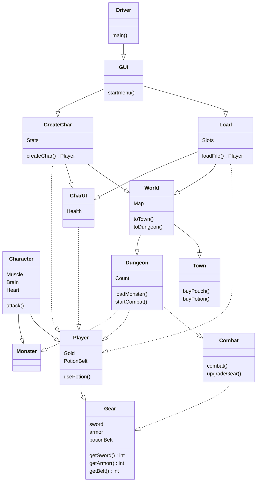

# Class Diagram

```mermaid
    classDiagram
        Combat
        Character --|> Monster
        Character --|> Player
        Driver --|> GUI
        GUI --|> CreateChar
        GUI --|> Load
        CreateChar ..|> Player
        CreateChar --|> CharUI
        CreateChar --|> World
        Load --|> CharUI
        Load --|> World
        Load ..|> Player
        World --|> Dungeon
        World --|> Town
        Player --|> Gear
        CharUI ..|> Player
        Dungeon ..|> Monster
        Dungeon ..|> Player
        Dungeon ..|> Combat
        Combat ..|> Gear

        class Driver{
            main()
        }

        class GUI{
            startmenu()
        }

        class CreateChar{
            Stats
            createChar() Player
        }

        class Load{
            Slots
            loadFile() Player
        }

        class CharUI{
            Health

        }

        class World{
            Map
            toTown()
            toDungeon()
        }

        class Character{
            Muscle
            Brain
            Heart
            attack()
        }

        class Dungeon{
            Count
            loadMonster()
            startCombat()
        }

        class Town{
            buyPouch()
            buyPotion()
        }

        class Monster{

        }

        class Player{
            Gold
            PotionBelt
            usePotion()
        }

        class Combat{
            combat()
            upgradeGear()
        }

        class Gear{
            sword
            armor
            potionBelt
            getSword() int
            getArmor() int
            getBelt() int
        }
```
