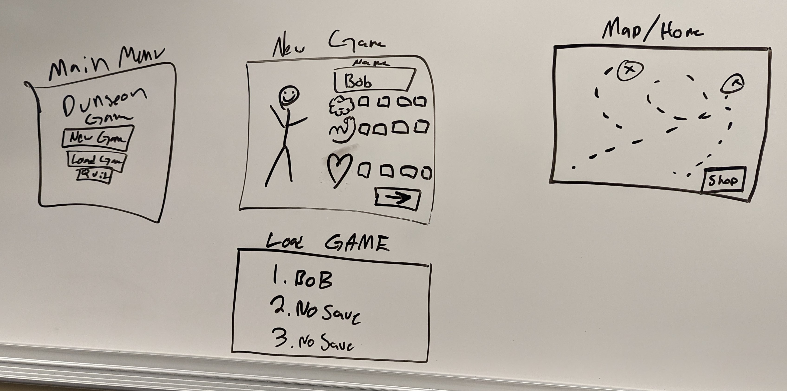

# Design Specification Documenation
- To view definitions of terms used in this document please go [here.](https://github.com/adrienabbey/REALLY-kinda-BAD-IDLE-GAME-Just-Kidding-The-Prequel-II/edit/main/docs/dsd.md#L83)

1. Implement a base start screen class that will guide the player in their journey. This start screen will consist of buttons that will prompt them for a "New Game", "Load Game", "Instructions", and "Quit".  Other important screens will be the world map and town. The world map will help the player navigate through the gameplay loop. It will have buttons to go into dungeons to start combat, and a button to go to the shop to allow the player to buy potions to give their character effects. *See picture at end of document for early mockups of what these screens would look like*
    1.  We will use a driver class that will help in providing a smoother user experience. This will be where the buttons on the start screen call to, allowing them to move to the character creation screen, load game screen, and the instructions screen.
    2.  These buttons will call to the driver to help guide the player to where they need to go.
    3.  The character screen will be accesed from a button on the world map. This screen will show the player a brief rundown of thier character (name, stats, equipment, potion belt, gold, etc.) 
2. Saving and loading the Player Character is done by implementing serializable on the Player Character class.  This enables saving the Player Character object to a file.  Public functions to do this are implemented in the Driver class.  The GUI will enable loading or saving the character.
    1. Loading a character is done from the main menu.  Saving a character is done in-game.
        1. From the main menu, the player can optionally load an existing character.  This loads the Player Character object from the save file, which then proceeds to the map screen.
        2. Saving the character can be done any time outside a dungeon.  This will be done either by clicking a GUI button on the world map, or automatically whenever transitioning into/out of a dungeon (to be determined).
            1. Saving is done much like loading, where the Player Character object is serialized and written to the save file.
    2. The Player Character object includes fields for the character's name, its stats (muscle, brain, heart), current gold, as well as the following:
        1.  The player's equipment will consist of a weapon, armor, and a hat.  These will likely be simple integer fields.
        2.  The player's carried potion count will be integer field of the player character.
            1.  Likewise, the potion belt size will also be an integer field of the player character.
            2.  Upgrading the potion belt size will be done from the town screen, requiring an exponentially scaling sum of gold.
3. This map will be the primary way the player will move and decide what to do with their character.
    1. These buttons will take the player to their respective screens. (Town screen for the town button, character screen for the charcter button, etc.)
4. The town shop is a seperate GUI window that uses the following functions:
    1. The player's potion belt is upgraded here.  The player can choose to spend a scaling amount of gold to upgrade their belt size.  Larger sizes require exponentially more gold.  This will be implemented as a Shop class function.  A UI button will call the funciton.  Exact costs TBD.
    2. The player can also buy potions here.  Each potion will have a fixed gold cost.  This will also be a Shop class function, called by a UI button.
    3. The player can also use a potion from their belt to heal themselves here.  The exact formula for how much a potion heals is TBD.
5. Implement a dungeon class which will load a corresponding screen from the driver class, combat functions will run in the combat class which will simulate combat based on the character and randomly selected monsters stats.
    1. The button on the world map will perform a check on player status before moving to the dungeon
        1. There will be multiple functions in the Dungeon class to initialize each dungeon.
        2. We will make a list of available monsters that the dungeon class will select from.
    2. The character screen or dungeon screen will have a button to control magic use, when the player characters attack function runs, it will check selection and run relevant functions.
        1. There will be a function for offensive spell use, and a function for healing spell use, this function will use a dice roll, the players current mana and the players brain stat to decide if a spell is cast, and how powerful the affect, and then will apply the health or damage, and drain the mana.
    3. The combat class will call the dice class and get stats from the player and monster.
        1. The combat class will check if either player or monster is dead between each attack, calling in a loop until combat is exited from a death or the player running.
    4. There will be a button programmed either on the character screen, map/town that will call a function in the playerCharacter class to consume a potion, reset the characters "awake" flag and timer, and heal the player.
    5. There is a "isAwake" flag in the playerCharacter class, that is checked, and when set to false starts a timer which is removed and the flag reset in the potion drinking function
        1. When the players awake flag is triggered to false, it will also kick the player back to the world map in the same function call.
    6. TThe combat class upon monster death will call a function to award gold based on monster, and another function that will use a dice function to determine if the player gets a +1 to an equipment slot.
        1. The combat function after doing rewards, and checking combat flags, will call a function to generate a new monster and enter back into combat loop.
    7. There will be a button to exit the dungeon.
        1. The function for the button will set a flag that combat will check before loading the next monster, and if set, will kick the player back to the world map.
        2. The combat loop will call the screen change function in the driver to the world map
6.  The player's gear will be implemented as simple integer fields of the Player Character object.
    1. Defeating monsters in dungeons will offer a chance to upgrade a piece of equipment.  This will be done using an Equipment Upgrade class with functions that determine the chance to upgrade after every fight.
        1. This function will compare the enemy's stats against the player's stats to determine this chance, where a stronger enemy will increase the chances, while a weaker enemy may reduce this chance to zero.  The exact algorithm is TBD.
        2.  If an upgrade is rewarded, it will upgrade a single piece of equipment.  Which piece of equipment is upgraded will be randomly chosen by another algorithm, weighted more favorably towards weaker items.
7. The player can mine ore and cut wood in their corresponding panels.
    1. Wood, stone, and metal will be stored in their respective variables in the inventory class.
    2. The player can choose to either "mine ore" or "scavenge area" using buttons located on the mineshaft panel.
    3. The player can choose to either "cut wood" or "hunt wildlife" using buttons located on the forest panel.
    4. The forest and mineshaft panels will have background music and image.
8. The player can choose to buy a homestead using the home panel located on the world map screen.
9. There will be a tavern, library, and bazaar screens that can be accessed using the buttons located on the town screen menu.
    1. The tavern screen will house the implementation for chatting with townsfolk. There will be various prompts for different NPCs.
        1. Prompts interate around a predetermined set of prompts whenever the player presses the "Talk to townsfolk" button. Prompts will loop.
        2. Each prompt will have an accompanying voice-over sound byte narrating the prompt text.
    2. The bazaar screen will allow the player to buy and sell items from their inventory. The bazaar will also allow the player to look into their
    inventory by clicking on the inventory button.
    3. The library screen will have the implementation for the "book of monsters" screen, which will contain the descriptions for monsters in the game.
10. There will be a rolling credits screen that can be accessed from the settings panel that will credit the developers, professor, art used, music used, and sound effect used.
11. Most if not all panels will have an accompanying background image and music implemeneted by calling a MusicPlayer class.
12. Most if not all of the buttons and will have an accompanying sound effect that will be implemeneted by calling the SFX class.

13. There shall be a status bar button and panel present in the forest and mineshaft screens implemented in the forest and mineshaft panels using Jbuttons and JPanel.
    1. The player will be able to view the status bar by clicking on the status bar button. The button will have an action listener that will, after being clicked,
       add the components of the status bar to the panel.
    2. The status bar panel will show the values of health, magic, and gold the player currently has by using a getter method in the Driver class to return the player object
       which houses the methods used to get the player's health, magic, and gold. These values will be updated everytime the player opens the status bar and during regenertaion
       of these values during resource gathering.

14. There will be a secret merhcant screen that can be accessed from the bazaar screen.
    1. The button that takes the player to the secret merchant panel will appear every fourth bazaar visit. A basic if statement is used to determine when
       to add the secret merhcant button to the bazaar screen. 
    3. The secret merchant will sell a secret item. This secret item will be added exclusively to the list of items the secret merchant sells through the absence of
       an if statement. The default list of items the player can buy in the bazaar screen excludes the secret item by using an if statement. 
   
15. Before the game loads up there will be a disclaimer message. This will be done through the use of an extra screen that appears before the start screen. 

## Images
 - This image is from an early meeting where we were planning out what screens we needed and what they needed to have on them.
 

## Terms:
1. Character: The playable and modifiable object that the player will use throughout the game. A character object includes things like stats, a name, and equipment.
2. Stat: A stat, or statistic, is the modifable values a character object contains.. These values affect the in-game behaviors of the character, such as with combat.
3. Muscle, brain, and heart stat: These stats modifies the players damage, mana points (MP), and heath points (HP) respectively.
4. Gold: The in-game monatery system that lets the player purchase potions. Gold can be acquired through combat in the dungeon.
5. Dungeon: Area where combat will take place. Contains monsters.
6. Monsters: Enemy objects that the player must fight.
7. Potion: Item that heals the player. Can be purchased from the town area.
8. Equipment: Items in te game that can be eqipped to the character and modify stats. Can be acquired through combat in the dungeon. 

## Signatures

- Adrien Abbey
- Luke Davidson
- Brandon Walker
- Muhammed Abushamma
